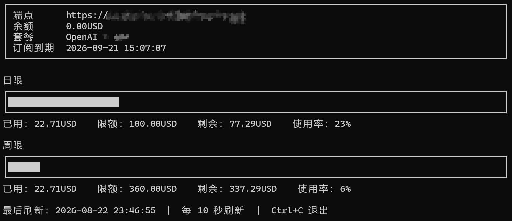

# sub2api

跨平台的 Sub2API 用量查询命令行工具。它会自动读取当前系统 Codex 使用的配置：



演示截图已对端点和套餐标识做模糊处理，不包含 API key、密码或私钥。

- Windows：`%USERPROFILE%\.codex\config.toml` 和 `auth.json`
- Linux：`$HOME/.codex/config.toml` 和 `auth.json`
- 也支持 `CODEX_HOME` 环境变量

工具只发送只读的 `GET /v1/usage` 请求，不会修改 Codex 配置，也不会把 key 写入项目、缓存或日志。

## 使用

```text
sub2api                 查询一次余额和日/周用量
sub2api -f              每 10 秒自动刷新
sub2api -f 30           每 30 秒自动刷新
```

`-f` 后面的数字表示刷新间隔秒数，不带数字时默认为 10 秒。自动刷新模式按 `Ctrl+C` 退出。

程序命令入口只有 `sub2api` 和 `sub2api -f [秒数]`，端点和 key 始终从当前系统 Codex 配置读取。

端点来自 `config.toml` 中当前 `model_provider` 对应的 `model_providers.*.base_url`，key 来自 `auth.json` 的 `OPENAI_API_KEY`。程序会自动处理配置端点已经包含 `/v1` 的情况。

订阅账户的 `余额` 与订阅额度分开显示：没有钱包充值余额时显示 `0.00USD`，日限/周限/余额进度条分别展示对应额度的已用、总额/限额、剩余及使用率（余额进度条的总额 = 已用 + 剩余额度）。

## 编译

需要 Go 1.22 或更新版本。

Windows PowerShell：

```powershell
.\build.ps1
```

Linux/macOS shell：

```sh
chmod +x build.sh
./build.sh
```

产物位于 `dist/`：

- `sub2api-windows-amd64.exe`
- `sub2api-linux-amd64`

安装到当前用户 PATH：

```powershell
.\install.ps1
```

```sh
chmod +x build.sh install.sh
./install.sh
```

也可以手动将 Windows 的 `sub2api-windows-amd64.exe` 重命名为 `sub2api.exe`，或将 Linux 的 `sub2api-linux-amd64` 重命名为 `sub2api` 并放入 PATH。

## 安全说明

不要把 `auth.json`、API key 或包含 key 的命令行复制到公开仓库。程序只从当前系统 Codex 目录读取认证信息，不会把认证内容写入仓库、日志或构建产物。
